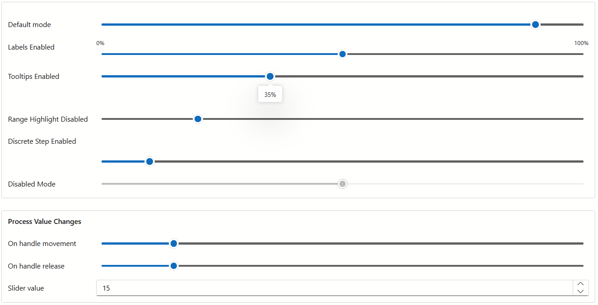

<!-- default badges list -->
[](https://supportcenter.devexpress.com/ticket/details/T1319057)
[](https://docs.devexpress.com/GeneralInformation/403183)
[](#does-this-example-address-your-development-requirementsobjectives)
<!-- default badges end -->
# Blazor - Use DevExtreme Slider in Blazor Applications

This example adds a [DevExtreme Slider widget](https://js.devexpress.com/jQuery/Documentation/Guide/UI_Components/Slider/Overview/) to a Blazor application and showcases the following features and capabilities:

* Min and max labels
* Tooltip customization
* Range highlight
* Discrete steps
* Disabled component state
* Dynamic value updates

The example replicates the [DevExtreme jQuery Slider](https://js.devexpress.com/jQuery/Demos/WidgetsGallery/Demo/Slider/Overview/FluentBlueLight/) demo.



## Implementation Details

### Register DevExtreme Resources

DevExtreme widgets require the use of [DevExtreme scripts and stylesheets](https://js.devexpress.com/jQuery/Documentation/Guide/jQuery_Components/Add_DevExtreme_to_a_jQuery_Application/#Local_Files). We recommend that you use [npm](https://js.devexpress.com/jQuery/Documentation/Guide/Common/Distribution_Channels/#npm) to incorporate DevExtreme into the application.

The DevExpress Blazor [Resource Manager](https://docs.devexpress.com/Blazor/DevExpress.Blazor.DxResourceManager) automatically registers DevExtreme scripts if your project includes the `DevExpress.Blazor` package. To apply the DevExtreme Fluent theme, add the [dx.fluent.blue.light.css](./BlazorSlider/wwwroot/css/dx.fluent.blue.light.css) file to the [wwwroot/css](./BlazorSlider/wwwroot/css/) folder and reference this stylesheet in the [Components/App.razor](./BlazorSlider/Components/App.razor#L12) file.

### Implement a Wrapper

Implement a Blazor component that wraps the DevExtreme Slider widget. The wrapper consists of the following files (copy them to your solution):

1. [SliderState.cs](./BlazorSlider/Components/Slider/SliderState.cs) defines a data model that stores slider properties. The model is passed to razor components via cascading parameters to initialize slider states in their `OnInitialized` lifecycle methods.
2. [DxSliderLabelSettings.razor](./BlazorSlider/Components/Slider/DxSliderLabelSettings.razor) and [DxSliderTooltipSettings.razor](./BlazorSlider/Components/Slider/DxSliderTooltipSettings.razor) configure slider label and tooltip settings.
3. [DxSlider.razor.js](./BlazorSlider/Components/Slider/DxSlider.razor.js) binds the DevExtreme Slider component to the data model.
4. [DxSlider.razor](./BlazorSlider/Components/Slider/DxSlider.razor) renders the Slider as follows:
    * Declares a `CascadingValue` component and uses a `ChildContent` parameter to customize slider labels and tooltips via Blazor parameters:
        ```Razor
        <CascadingValue IsFixed="true" Value="sliderState">
            @ChildContent
            <div @ref="sliderElement"></div>
        </CascadingValue>
        ```
    * In the `OnAfterRenderAsync` lifecycle method, calls the [LoadDxResources](https://docs.devexpress.com/Blazor/DevExpress.Blazor.DxResourceManager.LoadDxResources(Microsoft.JSInterop.IJSRuntime)) method to force the `Resource Manager` to load all client scripts.
    * In the [OnParametersSetAsync](./BlazorSlider/Components/Slider/DxSlider.razor#L57-L64) lifecycle method, updates the internal model state and rerenders the slider component once Blazor parameters change.
    * In the [UpdateValueFromClient](./BlazorSlider/Components/Slider/DxSlider.razor#L85-L91) method, synchronizes the server-side state with slider client-side value changes.

### Display a Blazor Component

Use the wrapper as a standard Blazor component. This example adds the [DevExpress Blazor FormLayout](https://docs.devexpress.com/Blazor/DevExpress.Blazor.DxFormLayout) component to the [Index.razor](./BlazorSlider/Components/Pages/Index.razor) file and declares `DxSlider` objects within layout items to display various slider states and capabilities.

```Razor
<DxSlider T="int" MinValue="0" MaxValue="100" Value="50">
    <DxSliderLabelSettings Visible="true"
                            Position="VerticalEdge.Top" />
</DxSlider>
```

## Files to Review

- [DxSlider.razor](/BlazorSlider/Components/Slider/DxSlider.razor)
- [DxSlider.razor.js](/BlazorSlider/Components/Slider/DxSlider.razor.js)
- [DxSliderLabelSettings.razor](/BlazorSlider/Components/Slider/DxSliderLabelSettings.razor)
- [DxSliderTooltipSettings.razor](/BlazorSlider/Components/Slider/DxSliderTooltipSettings.razor)
- [SliderState.cs](/BlazorSlider/Components/Slider/SliderState.cs)
- [App.razor](/BlazorSlider/Components/App.razor)
- [Index.razor](/BlazorSlider/Components/Pages/Index.razor)

## Documentation

- [Add DevExtreme Components to a Blazor Application](https://docs.devexpress.com/Blazor/403578/components/devextreme-components-in-blazor)
- [Get Started with DevExtreme jQuery/JS](https://js.devexpress.com/jQuery/Documentation/Guide/Common/First_Steps/)
- [DevExtreme JavaScript/jQuery Slider](https://js.devexpress.com/jQuery/Documentation/Guide/UI_Components/Slider/Overview/)

## More Examples

- [Blazor - Use DevExtreme Circular Gauge in a Blazor Application](https://github.com/DevExpress-Examples/blazor-use-devextreme-circular-gauge)
- [Blazor - Use DevExtreme Diagram in Blazor Applications](https://github.com/DevExpress-Examples/blazor-use-devextreme-diagram)

<!-- feedback -->
## Does this example address your development requirements/objectives?

[](https://www.devexpress.com/support/examples/survey.xml?utm_source=github&utm_campaign=draft-example-blazor-slider&~~~was_helpful=yes) [](https://www.devexpress.com/support/examples/survey.xml?utm_source=github&utm_campaign=draft-example-blazor-slider&~~~was_helpful=no)

(you will be redirected to DevExpress.com to submit your response)
<!-- feedback end -->
